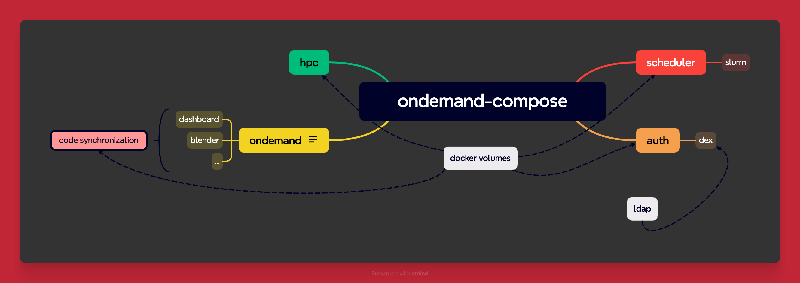

# Docker Compose for Open OnDemand 

This repository contains a Docker Compose file that sets up services for Open OnDemand https://github.com/OSC/ondemand.

## Services

### OnDemand
The OnDemand service is built from the Dockerfile in the `./ondemand` directory. It exposes ports 80, 8080, 5554, and 5556. This service depends on the LDAP service and will restart unless manually stopped.

### LDAP
The LDAP service is built from the Dockerfile in the `./ldap` directory. It exposes ports 389 and 636. The environment variables set up the LDAP organization, domain, and admin password. The service will restart unless manually stopped.

## Networks

OnDemand and LDAP are part of the `network-1` network, which uses the Docker 'bridge' driver.

## Usage

To **build** the services, navigate to the directory containing the `docker-compose.yml` file and run:
docker-compose build --no-cache

To **start** the services, navigate to the directory containing the `docker-compose.yml` file and run:
docker-compose up

To **stop** the services, use:
docker-compose down

## Requirements

- Docker
- Docker Compose

Please ensure that you have the latest versions of Docker and Docker Compose installed on your system.
